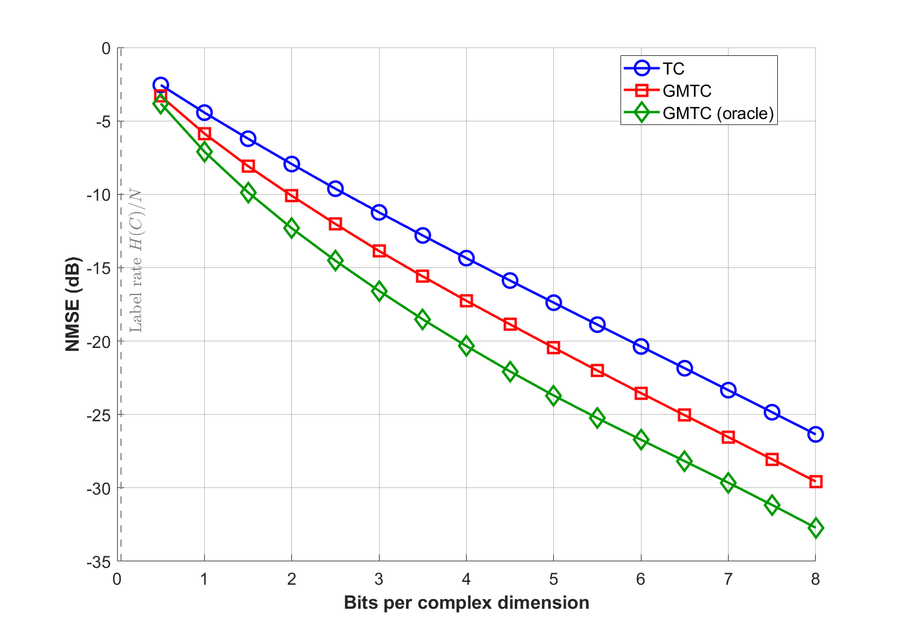
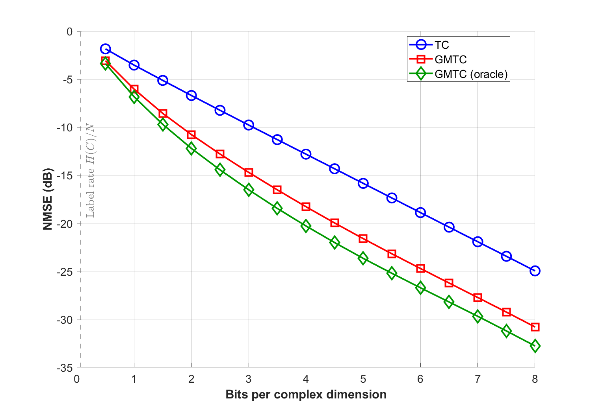
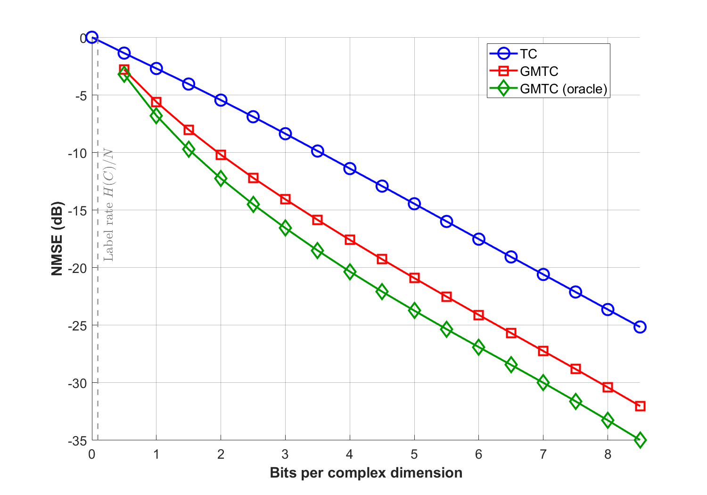
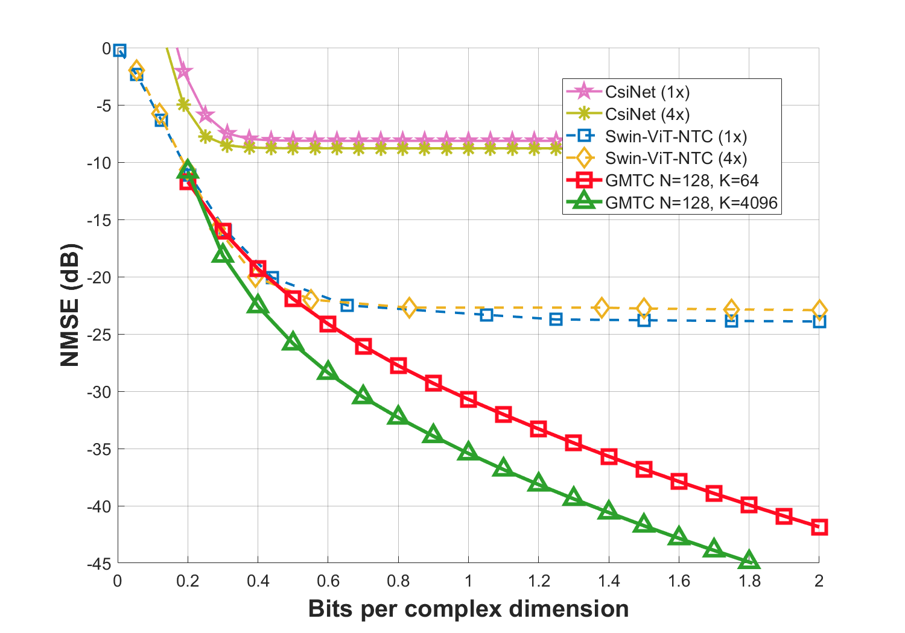
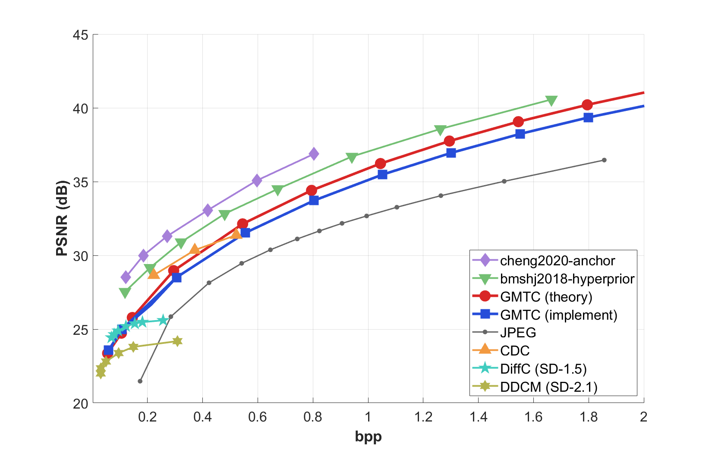
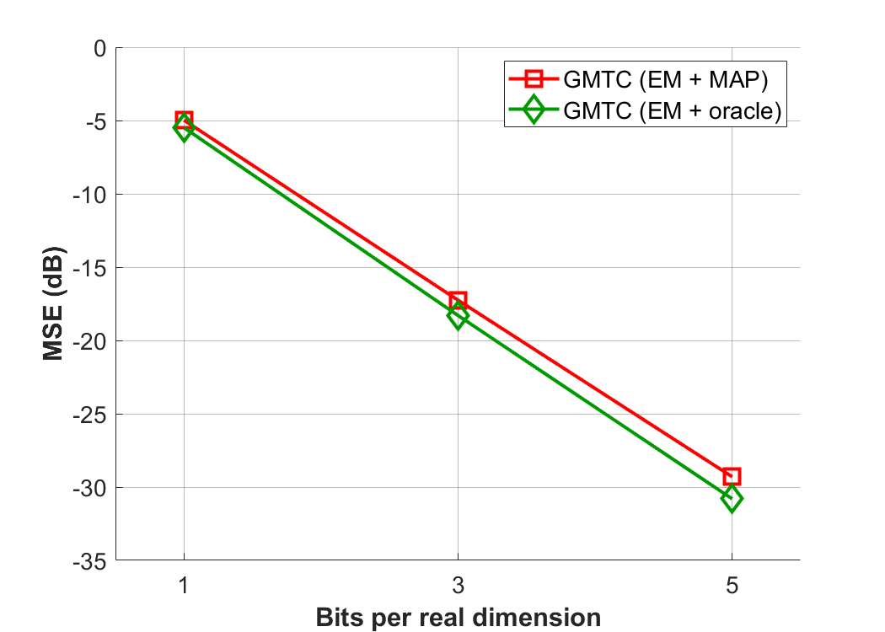

# [ICML26] Lossy Compression via Gaussian Mixture Transform Coding

## Figures

### Figure 1. NMSE (dB) — Synthetic GMM Dataset

### Figure 2. NMSE (dB) — COST2100 Dataset

### Figure 3. PSNR (dB) — Kodak Dataset

### Figure 4. MSE (dB) — MAP Mismatch

